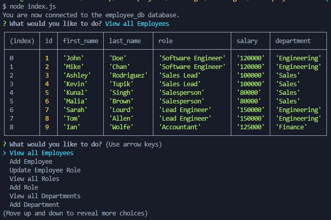

# c12-Employee-Tracker 

## Description
  
This application uses inquirer to allow the user to access an employee database. The database allows the user to view and update their businesses departments,
roles, and employees.
  
## Table of Contents (Optional)
  
 - [Installation](#installation)
 - [Usage](#usage)
 - [Credits](#credits)
 - [Features](#features)
 - [Questions](#questions)
  
## Installation
  
If you've cloned/branched this repo, you'll need to npm install, but otherwise it's not necessary.
  
## Usage
  
To use this application, clone/branch the repo. Open the terminal inside the directory, run "npm install", then once that's finished type "node index.js" to run the application.

Once the application is running, select your desired option and follow along with the prompts.

Example of application running:

Or you can [watch a brief video demonstration](https://drive.google.com/file/d/1uqC6zM-MHdlH5eF9y5g3TYYCaYgVt4EH/view)
  
## Credits
  
Shouts out to inquirer, everyone on stackoverflow, AskBCS, and reddit you the realest!

And me, Ian Wolfe.
  
## Features
  
This project features inquirer to prompt the user for input and postgres to store the data.

## Questions

For any questions about this project, please visit my [GitHub](https://github.com/enkw).
